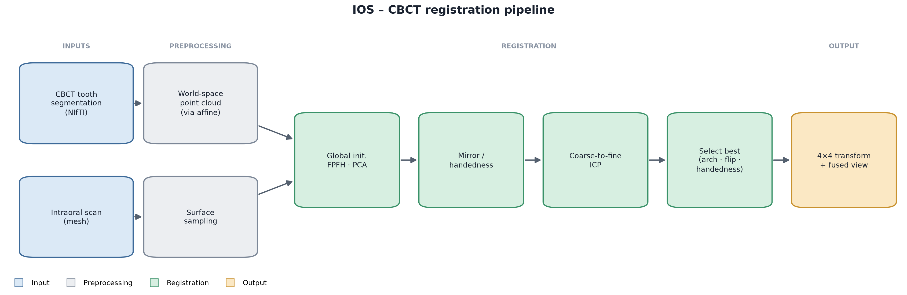
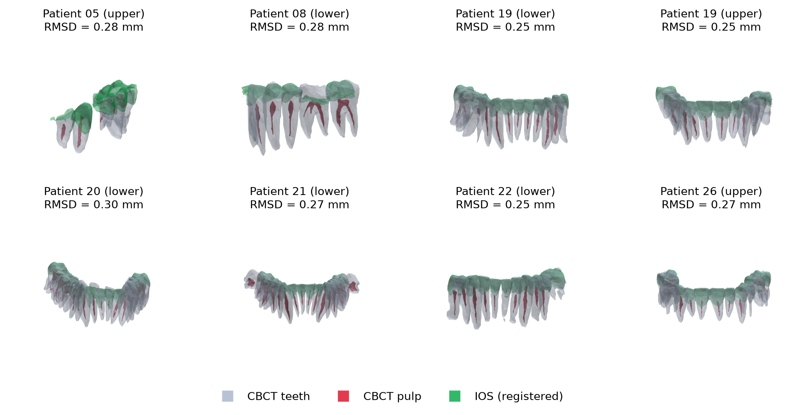

# Multi-Vis-Prep

**Multimodal visualisation of dental preparations by fusing CBCT and intraoral scans.**

This repository registers an intraoral scan (IOS) onto CBCT teeth and pulp
segmentations, so the internal structure of a dental preparation (in particular
its pulp) can be visualised relative to the scanned crowns, without an
intra-operative scan. It ships with an interactive web viewer, a command-line
pipeline, and evaluation and figure-generation scripts.



*The pipeline takes three inputs (a CBCT tooth segmentation, a CBCT pulp
segmentation and an intraoral scan), aligns them with a fully automatic
surface-based registration, and returns a 4×4 transform and a fused view.*



*Green: registered intraoral scan. Grey: CBCT teeth. Red: pulp. Surfaces are drawn
semi-transparent so the pulp remains visible inside the crowns.*

---

## Method in brief

- **Segmentation.** Teeth and pulp are segmented from the CBCT with
  [TIPs](https://www.sciencedirect.com/science/article/abs/pii/S0933365725001824),
  giving per-tooth (FDI-labelled) instance masks and a pulp mask as NIfTI volumes.
- **Registration.** The IOS mesh is aligned to the tooth surfaces with a fully
  automated surface-based pipeline:
  1. the segmentation is converted to a world-space surface point cloud;
  2. a global alignment is found from FPFH features + RANSAC **and** from PCA
     principal-axis matching (covering the arch-flip ambiguity);
  3. the mirror-image handedness of the scanner export is corrected (the IOS is a
     reflection of the CBCT frame, which a rigid transform alone cannot undo);
  4. the alignment is refined with coarse-to-fine point-to-plane ICP;
  5. the best candidate over arch, flip and handedness is chosen by a strict
     0.5&nbsp;mm surface-overlap score.
- **Output.** A 4×4 transform mapping IOS → CBCT (with its inverse), and the pulp
  carried into the same frame for visualisation.

---

## Requirements

- **Python 3.12** (Open3D's stable wheels do not cover 3.13, and the 3.9 wheel is
  unstable on macOS). On macOS: `brew install python@3.12`.
- Packages in `requirements.txt`: numpy, open3d, nibabel, scipy, scikit-image,
  matplotlib, flask.

## Installation

```bash
git clone https://github.com/ImaneChafi/Multi-Vis-Prep.git
cd Multi-Vis-Prep
python3.12 -m venv .venv
.venv/bin/python -m pip install --upgrade pip
.venv/bin/python -m pip install -r requirements.txt
```

The registration pipeline, web viewer and figures need only `requirements.txt`.
The **TIPs** segmentation step is optional and heavier (nnU-Net v2 + GPU); install
it separately when you want to segment a raw CBCT — see
[Segmentation](#segmentation-getting-the-teeth--pulp-masks) below.

## Inputs

The tool takes **three files**, provided directly; nothing is read from any fixed
data folder.

- **CBCT tooth segmentation** — a NIfTI (`.nii` / `.nii.gz`). Per-tooth **FDI
  instance labels** (11–28 upper, 31–48 lower) enable automatic upper/lower arch
  selection; a plain binary mask is treated as the whole mouth.
- **CBCT pulp segmentation** — a NIfTI, carried into the IOS frame so the pulp can
  be visualised inside the registered crowns.
- **Intraoral scan** — a surface mesh (`.ply` or `.stl`). If the file name
  contains `_l_`/`_u_`, the arch is preselected as lower/upper.

If you only have a **raw CBCT volume**, you do not need the two segmentations up
front: run [TIPs](#segmentation-getting-the-teeth--pulp-masks) to produce them
(from the command line, or via the *Segment with TIPs* button in the web viewer).

---

## Segmentation (getting the teeth + pulp masks)

The two CBCT segmentations are produced by **TIPs** (Tooth Instance and Pulp
segmentation, [github.com/TaoZhong11/TIPs](https://github.com/TaoZhong11/TIPs)),
whose code is bundled here (`TIPs.py`, `setup.py`, `nnunetv2.egg-info/`). It is an
nnU-Net v2 pipeline that outputs an FDI-labelled teeth-instance mask and a pulp
mask as NIfTI volumes.

**One-time setup** (GPU strongly recommended):

```bash
.venv/bin/python -m pip install -e .          # nnU-Net v2 stack
# install the U-Mamba trainer (see the TIPs repo)
# place the trained weights under ./nnResults/  (datasets 803 / 810 / 812)
```

**Run it** on a folder of CBCT `.nii.gz` volumes:

```bash
python TIPs.py /path/to/cbct_folder           # writes *_resample_*_instance/ outputs
```

or on a single volume through the wrapper, which returns the teeth + pulp paths:

```bash
python tips_segment.py scan.nii.gz --workdir ./outputs/tips_run
```

**In the web viewer**, upload a raw CBCT under *Only a raw CBCT?* and click
*Segment with TIPs*; the resulting teeth and pulp masks are kept server-side and
fed straight into registration, so you then only need to add the IOS. The button
is disabled with an explanation if the nnU-Net stack or weights are not installed.

### Alternative: DentalSegmentator

If you prefer a GUI tool, [DentalSegmentator](https://github.com/gaudot/SlicerDentalSegmentator)
is a free 3D Slicer extension that segments teeth, bone, sinus and canals from
CBCT. Install it from Slicer's Extensions Manager, load your CBCT volume, run the
*DentalSegmentator* module, and export the tooth (and pulp, where available)
labelmaps as NIfTI. Those exports can be dropped straight into the two CBCT inputs
of the registration tool in place of the TIPs output.

---

## Usage

### 1. Interactive web viewer (recommended)

```bash
python app.py
```

Open **http://127.0.0.1:5001**, then:

1. **Provide the CBCT teeth + pulp segmentations** — either upload both NIfTI
   files directly, or, if you only have a raw CBCT, upload it under *Only a raw
   CBCT?* and click *Segment with TIPs* to generate them.
2. **Upload the intraoral scan** (`.ply` / `.stl`).
3. **Pick an arch** — leave it on *Auto* to let the pipeline choose the best fit
   (or force *Upper* / *Lower* / *Both*). If the scan file name contains
   `_l_`/`_u_`, the arch is preselected for you.
4. Click **Register**.

The 3D viewer then shows the registered scan on the CBCT teeth and pulp as
semi-transparent surfaces. Use the sidebar to read the per-case quality metrics
(arch used, whether the IOS was mirrored, overlap @0.5&nbsp;mm, RMSD and
coverage, with a Good/Fair/Poor badge), to toggle each structure on and off, and
to drag the transparency slider. Drag to rotate, scroll to zoom, right-drag to
pan. Each run saves `T_ios_to_cbct.npy`, its inverse, and `summary.json` under
`outputs/<scan-name>/`.

### 2. Command line

```bash
python register_cli.py \
  --teeth teeth.nii.gz \
  --pulp pulp.nii.gz \
  --ios scan.ply \
  --arch auto \
  --out ./outputs/case01
```

Writes the 4×4 transform (`T_ios_to_cbct.npy` and its inverse), the registered IOS
mesh (`ios_registered.ply`, in CBCT space), and `summary.json` with the metrics.

### 3. Batch evaluation and figures (optional)

For reproducing a whole cohort, `eval_metrics.py`, `eval_all.py` and
`generate_figures.py` iterate a data folder. They read the roots from the
`SEG_ROOT` / `IOS_ROOT` environment variables (unset by default, so no folder is
touched unless you opt in). See the top of `registration.py` for the expected
per-patient folder structure.

---

## Metrics

- **NSD@0.5&nbsp;mm** (normalized surface Dice): fraction of the surface that agrees
  within 0.5&nbsp;mm. Range 0–1, **higher is better**; reflects how completely the
  scan overlaps the dentition.
- **ASSD / RMSD** (mm): average and root-mean-square symmetric surface distance over
  the matched region. **Lower is better**; reflects accuracy where the scan
  registered.

On the reported cohort the pipeline reaches a mean RMSD of ~0.27&nbsp;mm.

---

## Repository layout

```
TIPs.py                 CBCT teeth + pulp segmentation (nnU-Net v2; upstream TIPs)
tips_segment.py         wrapper: raw CBCT -> teeth + pulp masks (used by the app)
setup.py                nnU-Net v2 packaging for the TIPs stack
registration.py         core: segmentation-to-surface, global init, mirror, ICP
register_cli.py         command-line registration (--teeth / --pulp / --ios)
app.py                  Flask web viewer (upload teeth+pulp+IOS, or TIPs button)
templates/index.html    viewer UI (Three.js)
hausdorff_distance.py   surface Hausdorff distance helper (pymeshlab)
ios_post-processing/    IOS utilities (mirror mesh, remove gingiva)
eval_metrics.py         per-case metrics, cohort mode (optional)
eval_all.py             per-case metrics, extended cohort (optional)
generate_figures.py     per-patient PNGs + montage (optional)
preparation_montage.py  publication montage of registered cases (optional)
pipeline_figure.py      renders the schematic block diagram (assets/pipeline_diagram.png)
combined_pipeline.py    stacks the overview + pipeline into one figure
paper/                  LaTeX manuscript sections (method, results, tables)
assets/                 figures used in this README
```

## Notes
- Registration quality depends on IOS quality. Low-resolution or heavily decimated
  scans, and scans that cover only part of an arch, register less reliably; the
  strict NSD metric flags these cases.

## Citation

If you use this code, please cite the accompanying paper (ODIN workshop) and the
TIPs segmentation tool. Segmentation was performed with TIPs; registration and
visualisation are provided here.

## Acknowledgements

The authors would like to thank the authors of
[TIPs](https://www.sciencedirect.com/science/article/abs/pii/S0933365725001824)
and [DentalSegmentator](https://github.com/gaudot/SlicerDentalSegmentator) for
their code, which has been used here.

## License

See [LICENSE](LICENSE) (Apache 2.0). The bundled TIPs / nnU-Net components are
Apache-2.0 licensed upstream; DentalSegmentator, when used, is covered by its own
licence.
